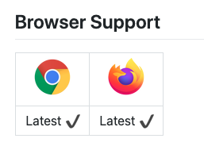

# Mamago Project

> 배포 주소: https://j3b103.p.ssafy.io/home
>

 

 

 

Table of Contents
-----------------

[1. 역할 및 기술](#1-역할-및-기술)

​    [- 주요 역할](#주요-역할)

​    [- 기술스택](#기술스택)

​    [- 시스템 구조도](#시스템-구조도)

[2. Mamago?](#2-Mamago)

[3. Mamago 주요기능](#3-Mamago-주요기능)

​    [- 이더리움 지갑생성](#이더리움-지갑생성)

​    [- 통역사 등록하기](#통역사-등록하기)

​    [- 통역 요청하기 - 계약정보 블록체인 저장](#통역-요청하기---계약정보-블록체인-저장)

​    [- 화상채팅](#화상채팅)

​    [- 평가 및 송금하기 - 평가 및 송금 내역 블록체인 저장](#평가-및-송금하기---평가-및-송금-내역-블록체인-저장)

[4. Mamago 와이어프레임](#4-Mamago-와이어프레임)

​    [- 메인페이지](#메인페이지)

​    [- 통역 요청 페이지](#통역-요청-페이지)

​    [- 통역사 경력 정보 페이지](#통역사-경력-정보-페이지)

 

 

 

## 1. 역할 및 기술

 

### 주요 역할

Backend & Tech Leader - Backend 개발, Jenkins CI/CD 구축,AWS서버 및  Docker, NGINX 등 서비스 관리

 

### 기술스택

- **Frontend**: Vue.js, TypeScript, SCSS
- **Backend**: Node.js, Express.js, TypeScript, mongoDB, PM2
- **Chat Front & Server**: Vue, JavaScript, socker.io, redis, Docker
- **Geth Server**: Go Ethereum, Web3.js, Solidity, Remix IDE, Docker
- **CI/CD**: Gitlab, Jenkins
- **Tools**: AWS, NGINX, Jira, Mattermost, Slack, sonaQube

 

### 시스템 구조도

 

 

 

## 2. Mamago?

 

#### 간단하게 통역을 이용해보세요! :handshake:

- ##### 코로나로 인해 만나서 통역하기 두려우시죠?😮

  언택트시대에 걸맞게 화상통역을 도와주시고 '알'을 받아 가세요! :egg: 

  `알` 이란? 마마고 서비스에서 통용되는 화폐단위입니다.

- ##### 해외여행 중 긴급하게 통역을 해야할 일이 있는데 통역가를 구하기 힘드셨죠?🤔

  마마고를 사용해 손쉽게 통역가를 구해보세요.

- ##### 통역가의 실력과 신뢰도를 측정하기 힘드셨죠?🤷‍♀️

  블록체인을 이용해 내역과 경력을 증명해주는 저희 서비스를 한번 이용해보세요! :)

 

 

 

## 3. Mamago 주요기능

 

### 이더리움 지갑생성

> 회원가입시 기존의 지갑을 사용하거나 이더리움 지갑을 생성할 수 있습니다. 

 

 

 

### 통역사 등록하기

> 통역사로 등록해야만 통역에 참여할 수 있습니다. 통역사로 등록하려면 경력정보를 입력해야 합니다.

#### 마이페이지

#### 경력정보 추가

 

 

### 통역 요청하기 - 계약정보 블록체인 저장

> 시간, 요청사항, 금액 등을 입력하여 통역을 요청할 수 있습니다. 통역사는 해당 요청에 지원할 수 있으며, 채택된 통역사와 통역을 진행합니다.
>
> 통역사를 채택하게 될 시 계약 정보가 블록체인에 저장됩니다. 해당 계약정보를 이행하였는지 여부를 확인하여 송금 또는 취소를 진행합니다.

#### 통역 요청

#### 통역사 지원 및 채택

 

 

### 화상채팅

> 화상채팅을 통해 통역을 진행할 수 있습니다.

#### 진행중인 통역

 

 

### 평가 및 송금하기 - 평가 및 송금 내역 블록체인 저장

> 통역사에 대한 평가와 송금을 진행합니다. 평가와 송금 내역은 블록체인에 저장됩니다.

#### 마이페이지

#### 평가 및 송금하기

 

 

 

## 4. Mamago 와이어프레임

 

### 메인페이지

 

### 통역 요청 페이지

 

### 통역사 경력 정보 페이지

   

## Browser Support

